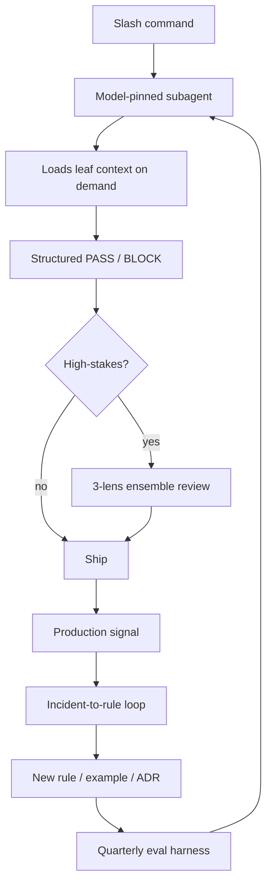

# Claude Agent Harness

A pattern for making an AI coding agent behave like a reliable engineer instead of a plausible one. Generalized from a production iOS app's `.claude/` setup — the app stays private, this is the reusable system around it.

> Layout note: in this repo the review subagents live at [`../agents/`](../agents), the skills that invoke them live in the companion [AI-Skills](https://github.com/brandonmorley13/AI-Skills) repo, and the process docs + templates + example context are here under `harness/`.

## 1. The problem

A single-shot coding agent produces plausible code. It compiles, it looks right, it matches the prompt. None of that means it's correct, secure, accessible, or consistent with the rest of the codebase. Plausibility and reliability are different properties, and an agent optimizing for "answer the prompt" has no built-in pressure toward the second one.

Verification has to be a separate, deliberate pass — not a hope that the first pass got it right.

## 2. The system

Four pieces, composed:

- **Model-pinned review subagents** (`../agents/`) — narrow, scoped reviewers. Each reads only what it needs, checks a fixed list, and returns a structured verdict.
- **Invocable skill workflows** (the [AI-Skills](https://github.com/brandonmorley13/AI-Skills) repo) — slash-command entry points that wire a subagent (or several) to a specific trigger: scaffold a feature, review a diff, run a pre-launch check.
- **Load-on-demand context** (`examples/CLAUDE.md`, `processes/context-engineering.md`) — a slim root rule set plus per-folder detail, read only when that folder is touched.
- **Quality loops** (`processes/`) — mechanisms that check whether the whole system is actually working, on a cadence, instead of assuming it is.

## 3. Why each design choice

**Why review agents are pinned to cheaper models and tool-capped.** A review is a checklist against a fixed set of rules — it doesn't need the most expensive model available, and it doesn't need unbounded tool access. Pinning `accessibility-checker` to a cheap tier and capping every agent at a fixed number of tool calls means thorough review stays cheap enough to run often. If review cost scaled with the flagship model's price, it would get invoked less, which defeats the point.

**Why nothing runs automatically.** Every agent and skill here is invoke-only. An agent that reviews every keystroke generates noise, trains the operator to skim past it, and burns the compute budget on changes that didn't need it. Deliberate invocation — a slash command, a direct request — means the review that does happen gets read.

**Why output is a PASS/BLOCK contract rather than prose.** A severity-tagged finding with a file, a line, a fix, and a citation is something you act on in five seconds. A paragraph of hedged prose is something you have to re-read and interpret. The contract format (`[SEVERITY] summary / File / Issue / Fix / Cites`, ending in `VERDICT: PASS` or `VERDICT: BLOCK — N CRITICAL, M HIGH`) forces the agent to commit to a verdict instead of describing the situation and leaving the judgment call to you.

## 4. The three quality loops

Subagents catch problems in a single diff. These three loops catch problems in the *system that produces subagents* — they're how you find out the rules have drifted, before production tells you.

- **Eval harness** (`processes/eval-harness.md`) — a fixed prompt suite with expected behaviors, scored against metric targets (≥95% anti-pattern catch rate), run quarterly. This is what turns "I think the rules still work" into a number.
- **Multi-lens ensemble** (`processes/ensemble-review.md`) — for genuinely high-stakes diffs, run the same change through three model tiers with different prompt scaffolds (correctness / security / does-it-ship) and take the union of findings. Diversity of scaffold catches what redundancy can't; three identical prompts would have added almost nothing.
- **Incident → rule** (`processes/incident-to-rule.md`) — every production signal (a crash, a rejected store submission, a customer ticket) gets root-caused within 48 hours and turned into a rule, an annotated example, or an architecture decision record. Fixing the bug without capturing the rule means the same mistake ships again.

## 5. Context engineering

Detailed in `processes/context-engineering.md`; the short version: a root rule file that tries to hold every rule for every area becomes too long for an agent (or a person) to actually apply. Instead, the root file holds invariants and a routing table — one row per area, pointing to that area's own `CLAUDE.md` leaf and the relevant domain doc. An agent editing the auth layer reads the auth leaf; an agent editing a view reads the theme leaf. Nobody reads the whole tree on every task.

This is a token-cost argument and a focus argument at the same time. Fewer irrelevant rules in context means cheaper calls, and it also means the rules that *are* in context are more likely to actually get applied, instead of getting lost in forty rules that don't apply to this diff.

## 6. How to use it

1. Copy the subagents from [`../agents/`](../agents) into your own `.claude/agents/`, and the skills from [AI-Skills](https://github.com/brandonmorley13/AI-Skills) into `.claude/skills/`.
2. Adapt `examples/CLAUDE.md` into your actual root rule file — fill in your platform baseline, architecture, data flow, and security section; build your own routing table pointing at your own folders.
3. Copy `templates/` as starting shapes and adjust to your stack.
4. Invoke a skill with its slash command (`/security-review`, `/a11y-check`, `/audit-integration`, `/perf-check`, `/pre-launch`, `/feature`) instead of asking for an unstructured review — the structured output is the point.
5. Once you have a handful of production incidents behind you, start the incident-to-rule loop. Once you have a stable rule set, start the quarterly eval harness.

## 7. Scope note

This is generalized from a private, production personal-finance app. The app itself — its code, its real architecture, its actual security configuration — is not here and never will be; publishing that would be irresponsible for something handling real financial data. What's here is the pattern: the shape of the subagents, the skill wiring, the context layout, the review loops. Names, paths, and vendor specifics have been replaced with generic equivalents. The value of this repo is the system, not a claim that any specific line of it is what the production app runs verbatim.

## Flow

